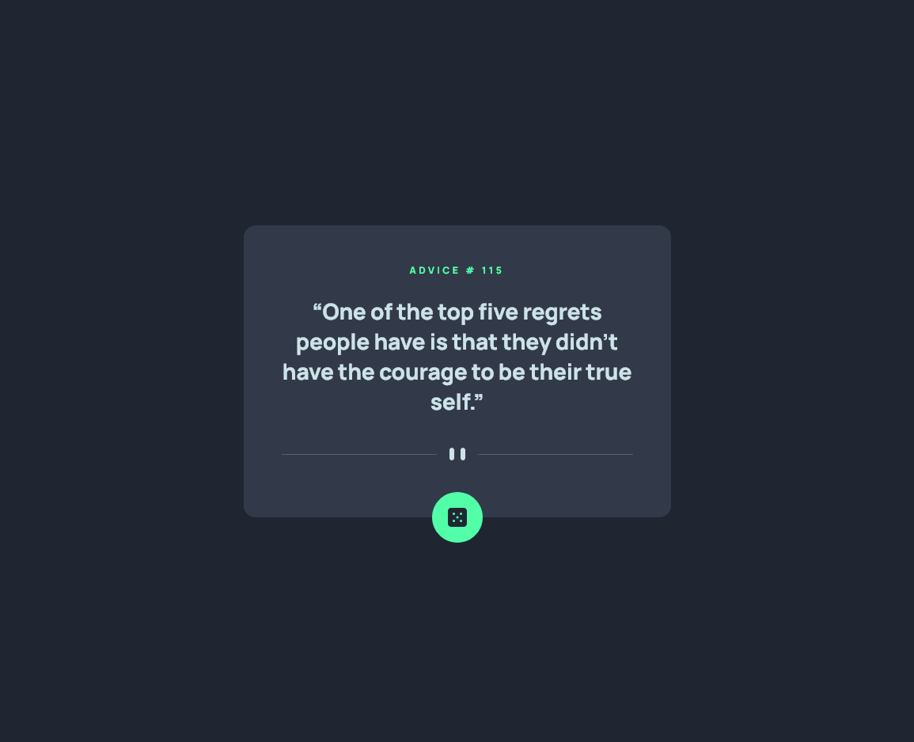

# Frontend Mentor - Advice generator app solution

This is a solution to the [Advice generator app challenge on Frontend Mentor](https://www.frontendmentor.io/challenges/advice-generator-app-QdUG-13db). Frontend Mentor challenges help you improve your coding skills by building realistic projects.

## Table of contents

- [Overview](#overview)
  - [The challenge](#the-challenge)
  - [Screenshot](#screenshot)
  - [Links](#links)
- [My process](#my-process)
  - [Built with](#built-with)
  - [What I learned](#what-i-learned)
  - [Useful resources](#useful-resources)
- [Author](#author)

## Overview

### The challenge

Users should be able to:

- View the optimal layout for the app depending on their device's screen size
- See hover states for all interactive elements on the page
- Generate a new piece of advice by clicking the dice icon

### Screenshot

### Links

- Solution URL: [View my solution on Frontend Mentor](https://www.frontendmentor.io/solutions/advice-app-using-htmlcssjs-FuchZj1v9)
- Live Site URL: [View this app on Netlify](https://condescending-colden-aeaf12.netlify.app/)

## My process

### Built with

- Semantic HTML5 markup
- CSS
- Flexbox
- Mobile-first workflow

### What I learned

This was a pretty simple project that used calls to the Advice Slip API. I utilized async functions to fetch data, then update the UI on each button click.

### Useful resources

- [MDN](https://developer.mozilla.org/en-US/docs/Web/JavaScript/Reference/Statements/async_function) - Just a quick refresher on async functions.

## Author

- Github - [My GitHub](https://www.github.com/ivanolmo)
- Frontend Mentor - [@ivanolmo](https://www.frontendmentor.io/profile/ivanolmo)
- Twitter - [@ivanbrolmo](https://www.twitter.com/ivanbrolmo)
