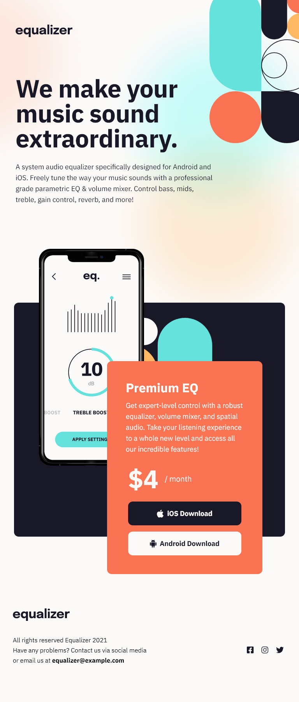

# Frontend Mentor - Equalizer landing page solution

This is a solution to the [Equalizer landing page challenge on Frontend Mentor](https://www.frontendmentor.io/challenges/equalizer-landing-page-7VJ4gp3DE). Frontend Mentor challenges help you improve your coding skills by building realistic projects.

## Table of contents

- [Overview](#overview)
  - [The challenge](#the-challenge)
  - [Screenshot](#screenshot)
  - [Links](#links)
- [My process](#my-process)
  - [Built with](#built-with)
  - [What I learned](#what-i-learned)
  - [Continued development](#continued-development)
  - [Useful resources](#useful-resources)
- [Author](#author)

## Overview

### The challenge

Users should be able to:

- View the optimal layout depending on their device's screen size
- See hover states for interactive elements

### Screenshot

### Links

- Solution URL: [View my solution on Frontend Mentor](https://www.frontendmentor.io/solutions/equalizer-page-using-htmlcss-some-flexbox-and-a-lot-of-clamp-ijXAu49Os)
- Live Site URL: [View live site on Netlify](https://elated-lovelace-ff3a37.netlify.app/)

## My process

### Built with

- Semantic HTML5 markup
- CSS custom properties
- Flexbox
- Mobile-first workflow

### What I learned

I used the CSS `clamp()` function for the first time in this project. Looking back, it's all over my stylesheet, but I'll probably change the way I use it moving forward.

In this project it's used for `font-size`, `margin`, `max-width`, and image/`background-image` sizing. It became
tedious to manage, especially with media queries. I think I'll only use it on `font-size` for now.

### Continued development

It'd be nice to clean up my media queries, because there's a little repetition in there. My CSS formatting
could probably be improved.

### Useful resources

- [MDN](https://developer.mozilla.org/en-US/docs/Web/CSS) - MDN, specifically the pages about `background-image`
  position/size, and of course the `clamp()` page.
- [CSS-Tricks.com](https://css-tricks.com/linearly-scale-font-size-with-css-clamp-based-on-the-viewport/) - This specific CSS-Tricks page is all about `clamp()`, and it has a great calculator to figure out your middle values. It was pretty accurate.

## Author

- Github - [My GitHub](https://www.github.com/ivanolmo)
- Frontend Mentor - [@ivanolmo](https://www.frontendmentor.io/profile/ivanolmo)
- Twitter - [@ivanbrolmo](https://www.twitter.com/ivanbrolmo)
