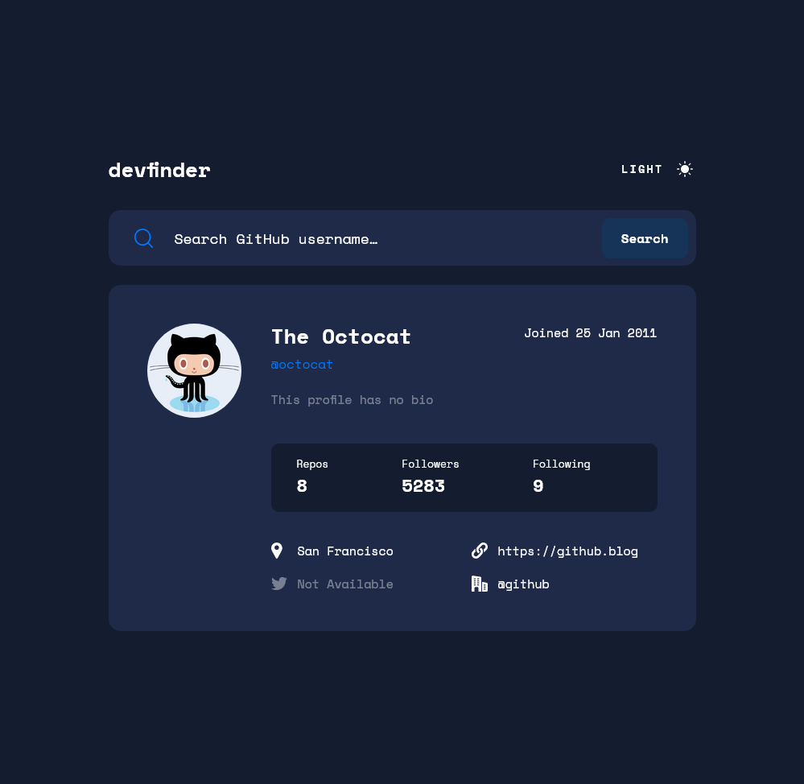

# Frontend Mentor - GitHub user search app solution

This is a solution to the [GitHub user search app challenge on Frontend Mentor](https://www.frontendmentor.io/challenges/github-user-search-app-Q09YOgaH6). Frontend Mentor challenges help you improve your coding skills by building realistic projects.

## Table of contents

- [Overview](#overview)
  - [The challenge](#the-challenge)
  - [Screenshot](#screenshot)
  - [Links](#links)
- [My process](#my-process)
  - [Built with](#built-with)
  - [What I learned](#what-i-learned)
  - [Continued development](#continued-development)
  - [Useful resources](#useful-resources)
- [Author](#author)
- [Acknowledgments](#acknowledgments)

## Overview

### The challenge

Users should be able to:

- View the optimal layout for the app depending on their device's screen size
- See hover states for all interactive elements on the page
- Search for GitHub users by their username
- See relevant user information based on their search
- Switch between light and dark themes
- **Bonus**: Have the correct color scheme chosen for them based on their computer preferences. _Hint_: Research `prefers-color-scheme` in CSS.

### Screenshot

https://user-images.githubusercontent.com/48425752/159422800-dcdcd065-d96d-4413-a93c-7f1897c4ddeb.mp4

### Links

- Solution URL: [View my solution on Frontend Mentor](https://www.frontendmentor.io/solutions/github-user-search-app-using-react-a_r1AKY55)
- Live Site URL: [View this app on Netlify](https://chipper-snickerdoodle-13334b.netlify.app/)

## My process

### Built with

- Semantic HTML5 markup
- CSS custom properties
- Flexbox
- CSS Grid
- Mobile-first workflow
- [React](https://reactjs.org/) - JS library

### What I learned

I definitely didn't need to use React for this project, but I wanted some practice, and overall I think it may have been a bit easier than using vanilla JS.

I did have some issues with the provided SVG components. I found out that SVGR is bundled in create-react-app, so importing the SVGs as React components just... worked.

Also, getting my search bar component all lined up (icon, input, button) kicked my butt, until I realized the icon and button don't have to go INSIDE the input.

### Continued development

I'm hoping to get useful feedback as far as my React implementation. If I do, and there are some learning opportunities, I think I'll come back and refactor. I'm not entirely sure my usage of the Context API was a good implementation. I did want some practice with it though.

Also, I would've liked to use SCSS styling in this project. Maybe I'll refactor, but I'll probably just use that on the next project.

### Useful resources

- [Very useful SVGR information](https://betterprogramming.pub/create-react-app-and-svgs-70970ac715f2) - This helped me with SVG usage. I didn't use any of the powerful features like passing SVG configuration as props, but I will in the future.
- [Conditional classes in React](https://www.pluralsight.com/guides/applying-classes-conditionally-react) - I stuck with using ternarys for some of my classes, but I learned about the Classnames library, which I may use in the future.
- [CSS Grid by Kevin Powell](https://www.youtube.com/watch?v=rg7Fvvl3taU) - Kevin's videos are great for tips and tricks on just about anything CSS. Not having to declare your grid rows isn't something you'd think works, but it does, and makes things just a tiny bit easier.

## Author

- Github - [My GitHub](https://www.github.com/ivanolmo)
- Frontend Mentor - [@ivanolmo](https://www.frontendmentor.io/profile/ivanolmo)
- Twitter - [@ivanbrolmo](https://www.twitter.com/ivanbrolmo)
