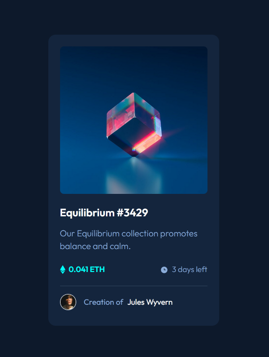

# Frontend Mentor - NFT preview card component solution

This is a solution to the [NFT preview card component challenge on Frontend Mentor](https://www.frontendmentor.io/challenges/nft-preview-card-component-SbdUL_w0U). Frontend Mentor challenges help you improve your coding skills by building realistic projects.

## Table of contents

- [Overview](#overview)
  - [The challenge](#the-challenge)
  - [Screenshot](#screenshot)
  - [Links](#links)
- [My process](#my-process)
  - [Built with](#built-with)
  - [What I learned](#what-i-learned)
  - [Continued development](#continued-development)
  - [Useful resources](#useful-resources)
- [Author](#author)
- [Acknowledgments](#acknowledgments)

## Overview

### The challenge

Users should be able to:

- View the optimal layout depending on their device's screen size
- See hover states for interactive elements

### Screenshot



### Links

- Solution URL: [View my solution on Frontend Mentor](https://www.frontendmentor.io/solutions/nft-card-using-just-html-and-css-IiAxfRtI4)
- Live Site URL: [View live site on Netlify](https://brave-knuth-bb1f10.netlify.app/)

## My process

### Built with

- Semantic HTML5 markup
- CSS custom properties
- Flexbox
- Mobile-first workflow

### What I learned

I can easily center a card in a page with 3 lines of Flexbox... who knew:

```css
body {
  display: flexbox;
  justify-content: center;
  align-items: center;
}
```

Also, setting a font size (even the very popular 62.5%) in the html element isn't necessary. For this project, I just assumed 1 rem = 16px, and sized everything from there.

### Useful resources

The Frontend Mentor community. I received some good feedback on my first project, and put it to use in this one. It definitely helped.

## Author

- Github - [My GitHub](https://www.github.com/ivanolmo)
- Frontend Mentor - [@ivanolmo](https://www.frontendmentor.io/profile/ivanolmo)
- Twitter - [@ivanbrolmo](https://www.twitter.com/ivanbrolmo)
